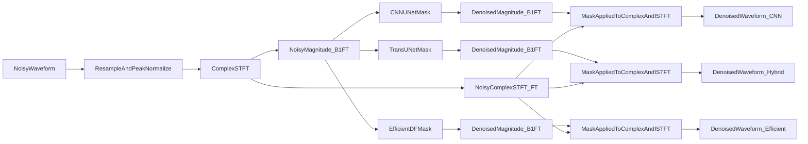

## Comparative Audio Denoising Evaluation

This repository compares three denoising architectures under one controlled protocol:

- `CNN U-Net` baseline
- `Audio TransUNet` hybrid model
- `DeepFilterNet-inspired` efficient model

### Project Structure

- `src/config`: typed configs and runtime path loading
- `src/data`: manifest builders, preprocessing, dynamic SNR mixer
- `src/models`: common model interface + 3 architectures
- `src/training`: shared trainer and training loop
- `src/eval`: quality metrics, latency/cost benchmark, interpretability, paper export
- `src/inference`: unified API + CLI to run all three models on one `.wav`
- `experiments`: scripts for training/evaluation/benchmarking
- `paper`: IEEE manuscript skeleton and generated figures/tables

### Model Input and Tensor Flow

Current models use **STFT magnitude spectrograms** (not waveform input, not mel-spectrogram).

- Input to all models: `noisy_mag` with shape `[B, 1, F, T]`
- Target during training: `clean_mag` with shape `[B, 1, F, T]`
- Output from all models: multiplicative mask `[B, 1, F, T]` and `denoised_mag = noisy_mag * mask`



Main preprocessing locations:
- `src/data/preprocessing.py` (`resample_if_needed`, `peak_normalize`, `compute_stft_magnitude`, `invert_stft`)
- `src/data/dynamic_mixer.py` (train-time on-the-fly mixing and spectrogram sample creation)
- `src/data/evalset.py` (fixed noisy eval-set generation)

### Environment

Use `uv` for all package and run commands.

```bash
uv sync
```

Create `.env` from `.env.example`:

```bash
cp .env.example .env
```

### Data Setup

Set environment variables:

- `LIBRISPEECH_ROOT`
- `AUDIOSET_ROOT`
- optional: `MANIFEST_DIR`, `OUTPUT_ROOT`
- optional: `REQUIRE_CUDA` (`1` to fail-fast if GPU is unavailable, default `0`)
- optional audio overrides from `.env`:
  - `CLIP_DURATION_SEC` (default `2.0`)
  - `SAMPLE_RATE_HZ` (default `16000`)
  - `MIN_SNR_DB` / `MAX_SNR_DB` (default `-5` / `20`)

Automated download (LibriSpeech + AudioSet):

```bash
uv run experiments/download_datasets.py --audioset-mode clips --max-audioset-clips 200
```

If you only want AudioSet metadata CSV files:

```bash
uv run experiments/download_datasets.py --audioset-mode metadata
```

Requirements for AudioSet clip downloading:

- `yt-dlp` (installed in this project dependencies)
- `ffmpeg` available on your system PATH

From zero, the typical data pipeline is:

```bash
uv run experiments/download_datasets.py --audioset-mode clips --max-audioset-clips 200
uv run experiments/prepare_data.py
```

Generate a fixed noisy set for reproducible listening/evaluation:

```bash
uv run experiments/generate_eval_noisy_set.py --num-samples 100 --split test
```

Example to change clip length globally (training + eval generation + preview + inference):

```bash
# in .env
CLIP_DURATION_SEC=4.0
```

Preview/listen one noisy sample:

```bash
# dynamic on-the-fly sample
uv run experiments/preview_sample.py --mode dynamic --split test

# fixed sample from generated eval set
uv run experiments/preview_sample.py --mode fixed
```

If `ffplay` is installed:

```bash
ffplay -autoexit experiments/preview/dynamic_noisy.wav
ffplay -autoexit experiments/preview/fixed_noisy.wav
```

### Training

```bash
uv run experiments/train_cnn.py
uv run experiments/train_hybrid.py
uv run experiments/train_eff.py
```

Device behavior:

- Uses GPU automatically when CUDA is available.
- Falls back to CPU when CUDA is unavailable.
- Set `REQUIRE_CUDA=1` in `.env` to fail fast instead of CPU fallback.

### Evaluation and Benchmarking

```bash
# If eval-set manifest exists, this aggregates metrics over full eval_set.
# By default, evaluate only trained models (start with cnn).
uv run experiments/evaluate_all.py --models cnn
uv run experiments/benchmark_latency.py
uv run experiments/export_paper_tables.py
```

To evaluate all three after training all checkpoints:

```bash
uv run experiments/evaluate_all.py --models cnn,hybrid,efficient
```

### Inference API / CLI

```bash
uv run src/inference/cli.py --input path/to/noisy.wav --output-dir experiments/inference_outputs
```

CLI behavior:
- By default, only models with available checkpoints are written to output files.
- Use `--models cnn` (or comma-separated list) to choose model subset.
- Use `--allow-untrained` only if you explicitly want outputs from random-weight models.

Inference length behavior:
- The current inference path processes the **full audio length** (it is not clipped to `CLIP_DURATION_SEC`).
- So yes, it can receive larger audio files.
- Current implementation is not chunked/streaming, so very long files increase memory and latency.

### Streamlit Demo

```bash
uv run streamlit run src/app.py
```

### Docker

```bash
docker compose up --build
```

